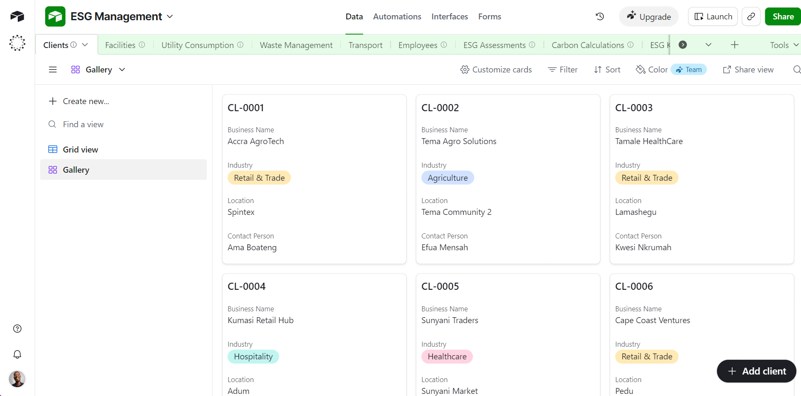
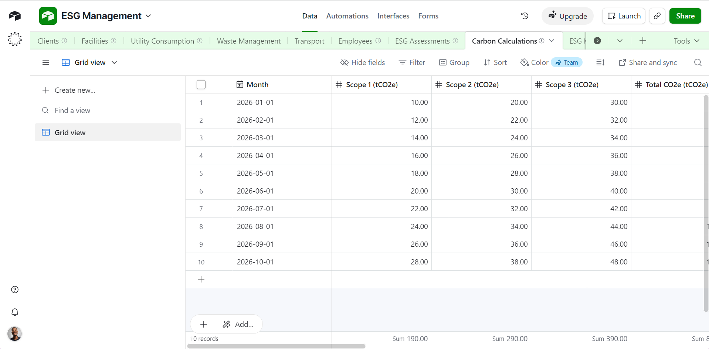

### Tekstain Nexus

**The Problem**

For many SMEs across Ghana, GHG emissions are difficult to measure. While ESG reporting and carbon disclosure are becoming increasingly important for accessing finance, winning contracts, and meeting supply chain requirements, most GHG accounting and reporting platforms are designed for large enterprises. They are often expensive, technically complex, and require dedicated sustainability teams that most Ghanaian SMEs simply do not have.

As a result, thousands of African businesses remain excluded from the growing low-carbon economy, not because they lack commitment, but because they lack affordable practical tools.

**Our Solution**

To build affordable, AI-enabled ESG and carbon management solutions designed specifically for Ghanaian SMEs and Cooperate organizations.

*Instead of requiring businesses to adopt costly enterprise software, we combine accessible digital platforms such as Airtable, Microsoft Power BI, and Tableau with internationally recognized ESG frameworks and GHG accounting standards to create a practical, scalable solution.*

**Our service enables businesses to:**

- Collect sustainability and operational data through simple digital workflows.
- Measure and track Scope 1, 2, and 3 greenhouse gas emissions.
- Generate ESG and carbon reports aligned with global reporting standards.
- Receive AI-driven insights that identify emission hotspots, operational inefficiencies, and opportunities to reduce costs and improve sustainability performance.

*By making GHG accounting and reporting accessible, affordable and actionable, Tekstain Nexus helps Ghanaian SMEs strengthen their ESG performance, unlock sustainable finance opportunities, meet customer and regulatory expectations, and compete successfully in an increasingly low-carbon global economy.*

**ESG Management Platform**

**System Architecture**

The Tekstain Nexus ESG Management service is designed to help Small and Medium-sized Enterprises (SMEs) in Ghana collect, manage, analyze, and report Environmental, Social, and Governance (ESG) data through a centralized Airtable-powered platform.

```text
                         ┌──────────────────────────┐
                         │     SME CLIENTS          │
                         │  (Businesses in Ghana)   │
                         └─────────────┬────────────┘
                                       │
                      ┌────────────────┴────────────────┐
                      │                                 │
          Airtable Forms & Surveys          Client Self-Service Portal
      (Data Submission & Assessments)    (Updates, Documents, Progress)
                      │                                 │
                      └────────────────┬────────────────┘
                                       │
                                       ▼
                         ┌──────────────────────────┐
                         │    AIRTABLE DATABASE     │
                         │   Central ESG Platform   │
                         └─────────────┬────────────┘
                                       │
      ┌──────────────┬─────────────────┼─────────────────┬──────────────┐
      │              │                 │                 │              │
      ▼              ▼                 ▼                 ▼              ▼
┌─────────┐   ┌─────────────┐   ┌────────────┐   ┌────────────┐   ┌────────────┐
│ Client  │   │ ESG Metrics │   │ Carbon     │   │ Documents  │   │ Compliance │
│ CRM     │   │ Repository  │   │ Accounting │   │ Repository │   │ & Risks    │
└─────────┘   └─────────────┘   └────────────┘   └────────────┘   └────────────┘
      └──────────────┬─────────────────┼─────────────────┬──────────────┘
                     │
                     ▼
          ┌──────────────────────────────┐
          │ Airtable Automation Engine   │
          │ • Workflows                  │
          │ • Notifications              │
          │ • Reminders                  │
          │ • Data Validation            │
          │ • AI Triggers                │
          └─────────────┬────────────────┘
                        │
          ┌─────────────┴────────────────┐
          │                              │
          ▼                              ▼
 ┌────────────────────┐         ┌────────────────────┐
 │ AI Recommendation  │         │ Power BI Analytics │
 │ Engine             │         │ & KPI Dashboards   │
 └────────────┬───────┘         └────────────┬───────┘
              │                              │
              └──────────────┬───────────────┘
                             ▼
                 ┌──────────────────────────┐
                 │ ESG Reports & Insights   │
                 │ • Carbon Reports         │
                 │ • ESG Scorecards         │
                 │ • Compliance Reports     │
                 │ • Executive Dashboards   │
                 │ • Improvement Plans      │
                 └─────────────┬────────────┘
                               │
                               ▼
                  Continuous ESG Monitoring &
                     Sustainability Improvement
```
**Gallary View**



**Grid View**


